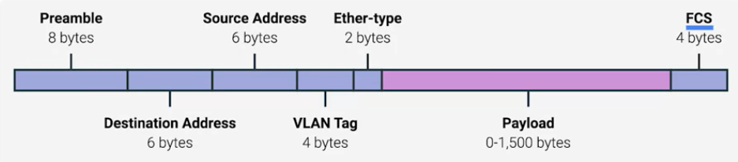

Week1 module consists of the following:

>+ [Introduction to Computer Networking](#introduction-to-computer-networking)
>+ [Basics of Networking Devices](#basics-of-networking-devices)
>+ [Physical Layer](#physical-layer)
>+ [Data Link Layer](#data-link-layer)

# Introduction to Computer Networking

**Computer Networking** is the full scope given to how the computers communicate with each other.
**Protocol** is a defined set of standards that computers must follow in order to communicate properly.

Computer Networking is divided into 5 layers:

>+ [Physical Layer](#physical-layer)
>+ [Data Link Layer](#data-link-layer)
>+ [Network Layer](#network-layer)
>+ [Transport Layer](#transport-layer)
>+ [Application Layer](#application-layer)

## Physical Layer

Physical layer involves the hardware or physical device that transfers the information. Ex: **Twisted copper wires, Optical Fibre**. Twisted pair cables are Cat5, cat5E and cat6.

## Data Link Layer

Data Link Layer provides a common way of interpretting the signals so that network devices can communicate. The most common protocol used in this layer is **Ethernet**.

## Network Layer

Network Layer transfers data two nodes. Allows different networks to communicate withe ach other through devices known as **Routers**. The most famous protocol used in this layers is **IP**. IPV4 and IPV6.

## Transport Layer

**Server** can handle the requests from the clients and can send the desired information upon the requst from the client. These client and server applications can run on the same virtual machine or node. Transport layer sorts to which client or server programs the data received is intended for.

## Application Layer

Application layer deals with the application programs used by us in day to day life.

# Basics of Networking Devices

## Network Cables 

Network cables are divided into **Twisted pair Copper Cables** and **Optic Fibre Cables**.

|   Copper Cables   |   Fibre Optic Cables  |
|-------------------|-----------------------|
|Cheap|Expensive|
|Transmit data by electric pulses Change in voltage levels|Transmit data by light propagation and total internal reflection|
|Twisted pair Cables|Non Twisted|
|Prone to cross-talking|Resistant to cross-talking|

## Hubs and Switches

**Hubs and Switches** sends data within the network.
**Hub** is a **layer 1** device that allows for connections from many computers at once. Only 1 computer can send te data at any given time. So, hubs are very rarely used.

**Network Switch** is a **layer 2** device and can sense to which node the data is intended for and sends the data only to that node. So, fewer collisions and hence higher throughput.

## Routers

**Routers** can send data across networks.
Router is a **layer 3** device that stores the information of where to route the data in the form of routing tables.

**Border Gateway Protcol(BGP)**: Routers share data with each other via this protocol which lets them learn about most optimal path to forward traffic.

# Physical Layer

## Moving Bits across wires

Data is transferred in the form of bits (0's and 1's).

## Twisted Pair cabling and Duplexing

**Twisted pairs** helps in avoiding electromagnnetic interference and cross-talk. They also allow duplex communication. 4 pairs of twisted cables are split into 2 in each direction thus facilitating a duplex communication.

**Half Duplex**: Coomunication is possible in both directions but only one direction at a time.

## Network ports and Patch panels

Twisted pair cables are terminated by RJ45 cable plugs.

**Network Port** is a port which contains an LED to indicate whether there is a linking or activity.

**Patch Panel** contains many network ports in a single device.

# Data Link Layer

## Eternet and MAC Address

Ethernet uses **Carrier Sense Multiple Access collision Detection CSMS/CD**

**MAC Address** A globally unique identifier attached to an individual network interface. MAC address is 48 bit. 6 groupings of 2 hexadecimal numbers.

## Unicast, Multicast and Broadcast

**Unicast** One to One
**Multicast** Many to One
**Broadcast** One to all the nodes in the network

## Dissecting an Ethernet Frame

**Ethernet Frame**: A highly structured collection of information presented in a specific order.

**Preamble** Contains informayion of Start Frame Delimiter(SFD) and synchronization information of the frame.

**Destination MAC Address** 6 byte information of the MAC Address of the destination.

**VLAN TAG** Same physical hardware containing multiple LANS. Ex: Comapany's landline and computers runs on different LAN.

**Frame Check Sequence(FCS)** This field contains information about the checksum alculated for the frame. It is helpful in case of cyclic redundancy check for errors.