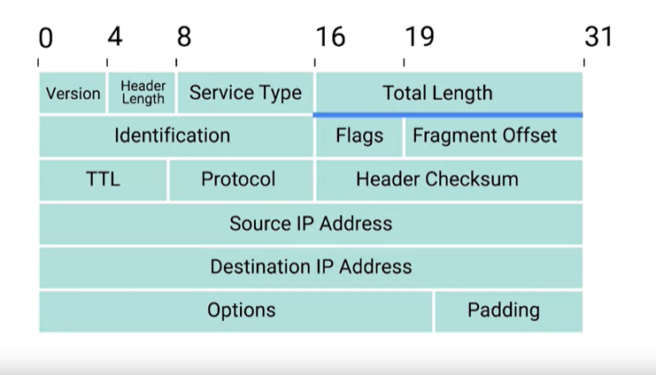
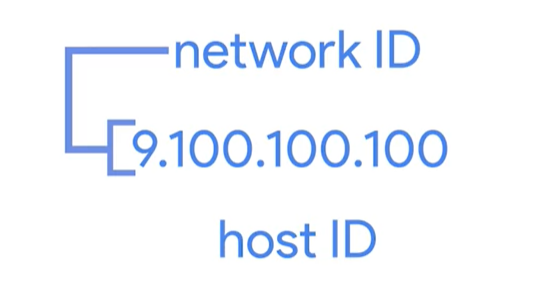
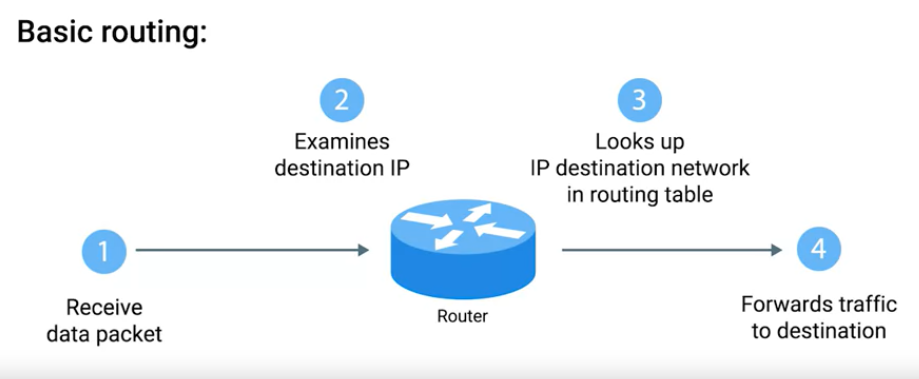
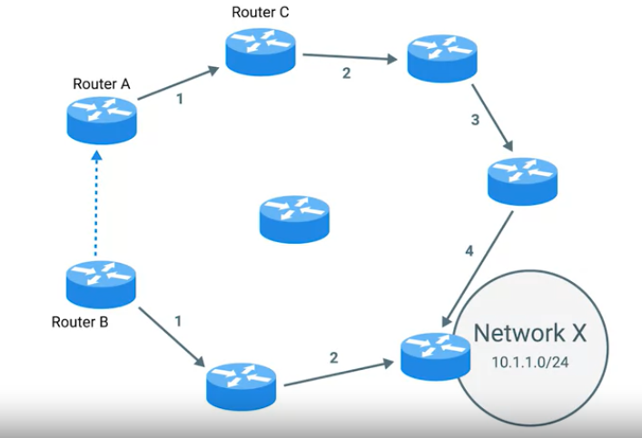
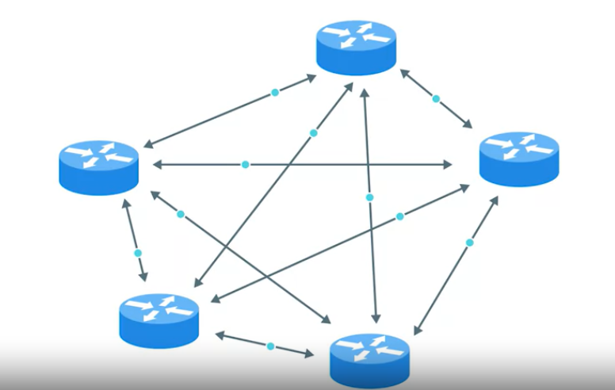

Week2 Module consists of the following:

>+ [The Network Layer](#the-network-layer)
>+ [Subnetting](#subnetting)
>+ [Routing](#routing)

# The Network Layer

## Network Layer

Nodes on a Local Area Network can quickly learn the physical MAC address of the nodes that they are connected to. But the way the MAC addresses are assigned globally there is no order. So, transferring information based on MAC address doesn't scale well.

## IP Address

Due to the shortcoming of the MAC address. IP addresses are used to send data from source to the destination.

32 bit Address (Dotted Decimal Notation)

IP address belong to networks, not to devices attached to those networks. IP address varies depending on the network to which our device is connected.

MAC address --> Unique. IP addresses will be assigned automatically by a protocol known as Dynamic Host Configuration Protocol. IP addresses assigned by this way are known as Dynamic IP address. There are static IP address as well.

## IP Datagrams and Encapsulation

**IP Datagram** is a highly structured series of fields that are strictly defined.



**Version** indicates what version of IP protocol is used. Common is IPV4.

**Header Length** is of 4 bits. Always 20 bytes for IPV4.

**Service Type** is of 8 bits and it can be used to specify details about Quality Of Service (QOS) technologies.

**Total Length** indicates the total length of IP data it is attached to. Maximum data that can be sent in a single IP datgram is 65,535.

**Identification Field** When data is greater than 65,535. Data is split into multiple datagrams. Identification field for all the split data will be same.

**Flag** is used to indicate if a datagram can be fragmented or it is already fragmented.

**Fragmentation Offset** contains data so that at the receiving end all the split data can be attached together to form a single datagram.

**Time To Live (TTL)** value is decremented by 1. After the value reaches 0. The data is no more forwarded just discarded.

**Protocol Field** indicates what transport layer protocol will be used.

**Header Checksum, Source IP Address, Destination Ip Address** are self explanatory.

**Options** sets special characteristics for the datagram for testing purpose.

**Padding** set of zeros to maintain the IP datgram length if no options field is available.

## IP Address Classes

IP Address is divided into two parts:
>+ Network ID
>+ Host ID

### Address Class System
It is a way of defining how thw global IP address space is split up.

Class A --> 1 Octet for network ID and 3 for host ID.

Class B --> 2 Octet for network ID and 2 for host ID.

Class C --> 3 Octet for network ID and 1 for host ID.

**Address Resolution Protocol (ARP)** is a protocol used to discover the hardware address of a node with a certain IP address.

**ARP Table** contains the list of IP addresses and the associated MAC addresses. The entries of ARP table expires after a short amount of time.

# Subnetting

The process of taking a larger network and splitting up into many individual and smaller subnetworks or subnets.

Each network will have a **Gateway Router** which serves as the entry point as well as the exit point for the traffic.

## Subnet Masks

Without the subnets, the IP address will be something like below:



IP Address space consists of only Network ID and host ID.

After the advent of subnet masks, IP Addresses consists of Network ID, Subnet ID and host ID.

Subnet ID's are calculated from subnet masks. The purpose od subnet masks is to tell the router what part of ID address is the subnet ID.

A subnet with a mask of ```255.255.255.0``` can only have 256 host ID's from 255.255.255.0 to 255.255.255.255.

## Classless Inter-Domain Routing (CIDR)

IP address --> 9.100.100.100
Subnet Mask --> 255.255.255.0 
 The above notation can also be written as 9.100.100.100/24.

**CIDR** combines Network ID and subnet ID into a contiguous chunk.

# Routing

## Basic Routing Concepts

**Router** is a network device that forwards traffic depending on the destination address of that traffic.

### Basic Routing:



1. Router receives data packet from its interface.
2. Examines the destination IP address of the packet.
3. Looks up for the destination IP in the routing table.
4. Forwards traffic to destination.

## Routing Tables

**Routing Tables** ahs the following columns:

**Destination Network**. Router has the catch all entry so that it can get the information if the destination network is not available in the routing table.

**Next Hop**

**Total Hops**

**Interface** to which the router must pass the packet so that it can reach the destination.

## Interior Gateway Protocol

Routing protocols fall into two categories:

>+ Interior Gateway protocols
>+ Exterior Gateway Protocols

**Interior Gateway Protocols** are used by the routers to share information within a single autonomous system.

**Autonomous System** is a collection of networks that fall under the control of a single network operator.

Interior Gateway Protocols are divided into two categories:

>+ Distance Vector Protocols
>+ Link-State Protocols

### Distance Vector Protocols



Information is  shared between routers in the form of distance vectors i.e., how many hops to reach the destination. Information is only shared to its immediate neighbors. So, changes in a network far away will reach this network after a considerable delay So, this protocol is less used.

### Link State Protocols



Information of the distance vectors of a router will be shared to all the routers in an autonomous system. Then complex algorithms will be run on the router to determine the shortest path to a destination.

## Exterior Gateway protocols

Share the information using edges of an autonomous system.

IANA --> Internet Assigned Numbers Authority does IP address alloaction as well as Autonomous System Number allocation.

## Non-routable Address Space

These are the address spaces to which data can't be routed.
 
10.0.0.0/8
172.16.0.0/12
192.168.0.0/16

