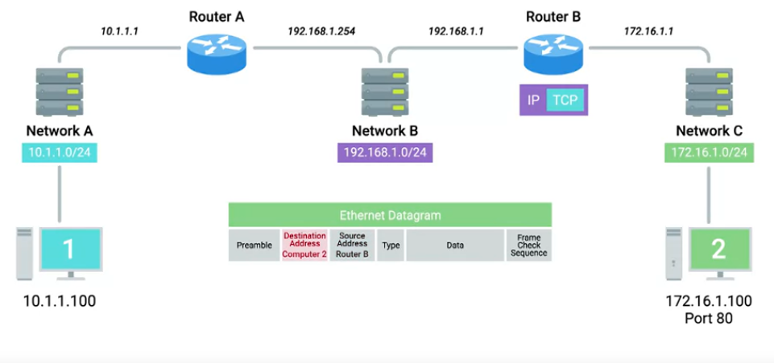

Week3 module consists of the following:

>+ [Introduction to Transport Layer](#introduction-to-transport-layer)
>+ [The Transport Layer](#the-transport-layer)
>+ [Application Layer](#application-layer)

# Introduction to Transport Layer

**Transport Layer** allows traffic to be directed to specific newtwork applications.

**Application Layer** allows application tocommunicate in a way they understand.

# The Transport Layer

## The Transport Layer

Functions of Transport Layer includes:

>+ Multiplexing
>+ Demultiplexing traffic
>+ Verifying data integrity through error checking and data verification

**Port** is a 16-bit number that's used to direct traffic to specific services running on networked computer.

Socket Address Format : 10.1.1.100:80

## Dissection of a TCP Segment

IP Datagram encapsulates TCP Segment.

**Destination Port** is the port in the destination address the traffic is intended for.

**Source Port** is a high numbered port chosen from a special section of ports known as Ephemeral Ports.

**Sequence Number** is a 32 bit number that is used to keep track of where in a sequence of TCP segments this segment is intended to be.

**Acknowledgement Number** indicates which segment numbers comes next.

**Data Offset Field or Header Length** indicates till where TCP header exists.

**Window** is 16 bits which specifies the range of sequence numbers that might be sent before an acknowledgement is required.

**Checksum** is 0f 16 bits

**Urgent** is 16 bits used in conjunction with one of the TCP control flags to point out that certain flags might be more important than others.

**Options** is 16 bits but rarely used.

## TCP Control Flags and Three Way Handshake

### Control Flags

**URG** a value of 1 indicates that the segment is considered urgent and urgent pointer field has more data about this.

**ACK** a value of 1 indicates that ACK should be examined.

**PSH** push the data buffered till now to the application on the receiving end as soon as possible.

**RST** is used to indicate that one of the sides in a TCP connection request hasn't been able to properly recover from a series of missing or malformed segments.

**SYN** is used when first establishing a connection request.

**FIN** is used to indicate that the data transfer is finished.

### TCP Connection Establishment

**Handshake** is a way for two devices to ensure that they are speaking same protocol and will be able to understand each other.

## TCP Socket States

**Socket** is an instantiation of an End point in a potential TCP connection.

**Instantiation** is the implementation of something defined elsewhere.

**Listen** A TCP socket is ready and listening for incoming connections.

**SYNC_SENT** A synchronization request has been sent but the connection hasn't been established yet.

**SYN_Received** A socket previously in a listen state has received a synchronization request and sent a SYN/ACK back.

**Established** A TCP connection is in working state and both sides are free to send each other data.

**FIN_WAIT** A FIN has been sent but the corresponding ACK from the other hasn't been recived yet.

**Close_WAIT** The connection has been closed at the TCP layer, but that application that has opened the socket hasn't released its hold on the socket yet.

**Closed** Connection is fully terminated.

## Connection Oriented and Connection less Protocols

**Connection Oriented Protocols** establishes a connection and uses the connection to ensure that all data has been properly transmitted. Essentially, getting an ACK for all the TCP segments. Connection-oriented protocols has a lot of overhead in establishing connection, sending ACK for each TCP segment and then closing TCP connection.

**Connectionless Protocols** sends data based on the destination address. No overhead as in TCP. Ex: UDP (User Datagram Protocol)

## Firewalls

**Firewall** is a device that blocks traffic when a certain criteria is met. Firewall at the transport layer blocks the traffic to certain ports that are confidential while allowing traffic to other ports.

# Application Layer

Data section in the TCP segment contains the entire information needed for the application.

Web browsers(clients) and web servers(servers) communicate via an application layer protocol known as **HTTP**.

## Application Layer and OSI Model

OSI --> Open System Interconnection

There are two additional layers in the OSI model.

**Session Layer** facilitates communication between actual applications and the transport layer.

**Presentation Layer** is responsible for making sure that the unencapsulated data from the transport layer is able to be understood by the application.

## Working of all the Layers

### Step 1

### Step 2

### Step 3

### Step 4

### Step 5

### Step 6

