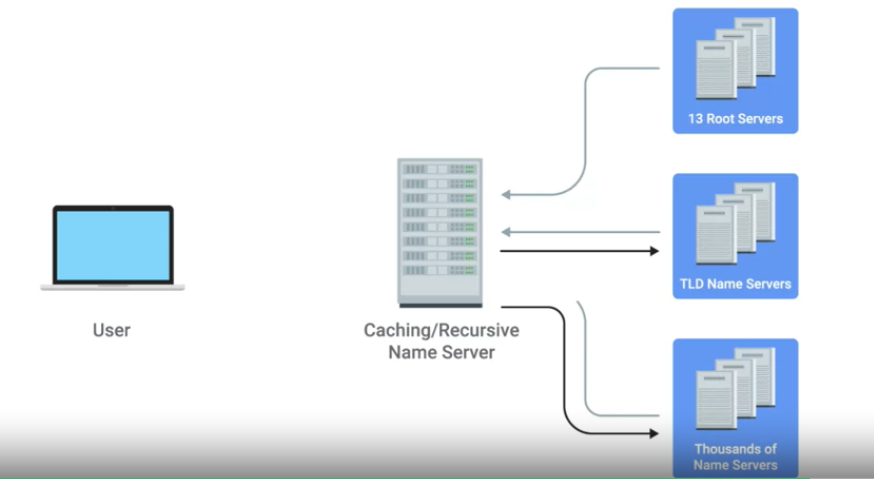
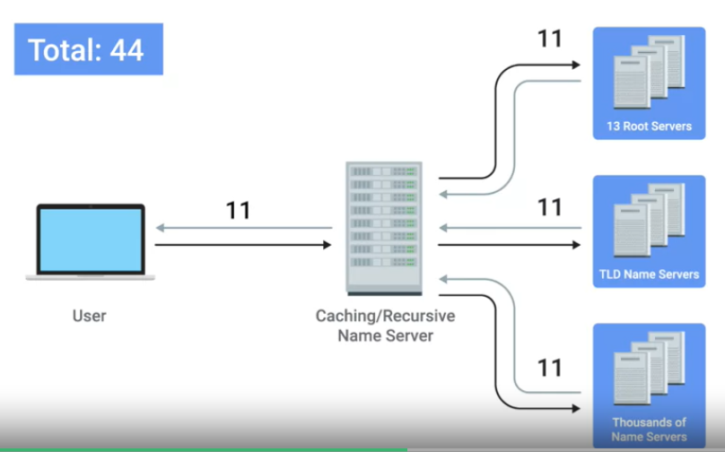
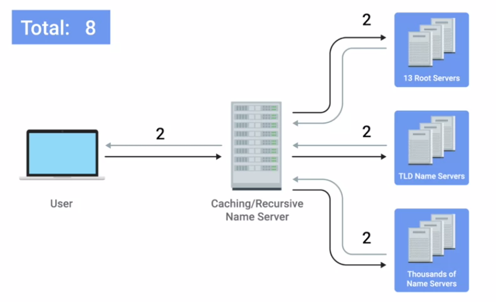
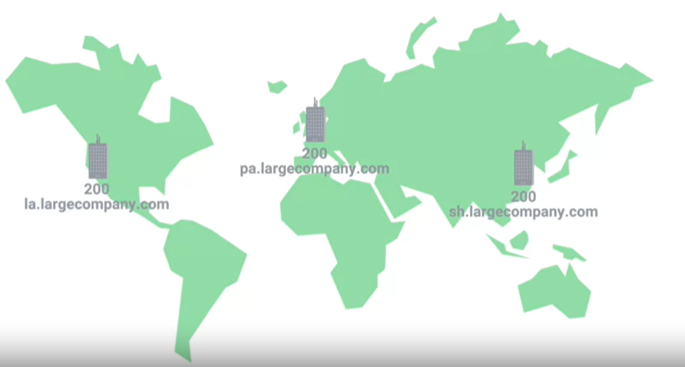
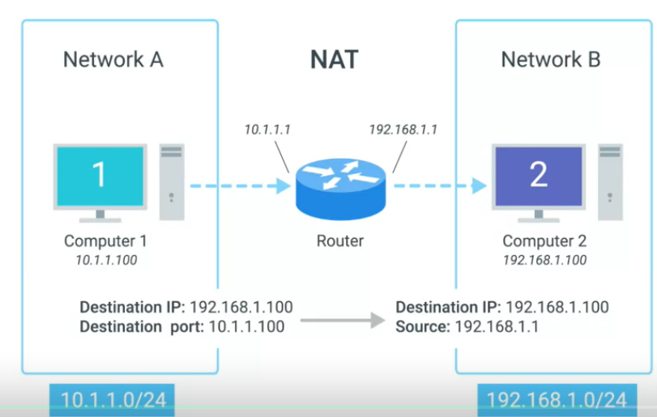
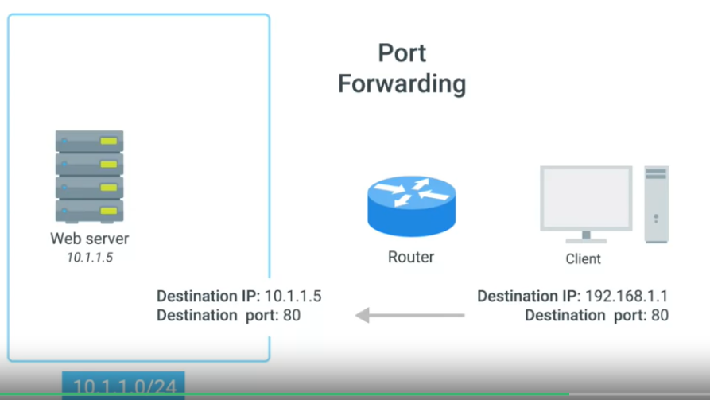
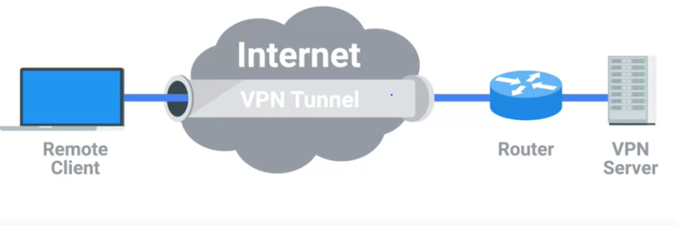

Week4 module consists of the following:

>+ [Introduction to Network Services](#introduction-to-network-services)
>+ [Name Resolution](#name-resolution)
>+ [Name Resolution in Practice](#name-resolution-in-practice)
>+ [Dynamic Host Configuration Protocol](#dynamic-host-configuration-protocol)
>+ [Network Address Translation](#network-address-translation)
>+ [VPNs and Proxy Services](#vPNs-and-proxy-services)

# Introduction to Network Services

Networking Services make computer networking more user-friendly and secure

# Name Resolution

Remebering names of words is much more simpler than remembering 32 bit IP address. So, DNS (Domain Name System) came into existence.

**Domain Name System** is a globally and highly distributed network service that resolves strings of letters into IP address for you.

**Domain Name** is a term we use for something that can be resolved by DNS.

## Many Steps of Name Resolution

Just like IP address, subnet mask, Gateway, DNS server also should be configured for a host.

There are five primary types of DNS servers:

1. Caching Name servers
2. Recursive Name servers
3. Root Name Servers
4. TLD Name Servers
5. Authoritative Name Servers.

### Caching and Recursive Name Servers

The purpose of caching servers is to store known domain name lookups for a certain amount of time.

Recursive servers are capable of performing fully qualified name resolution checks.

**Time To Live (TTL)** is a value in seconds that can be configured by the owner of a domain name for how long a name server is allowed to cache an entry before it should discard it and perform full name resolution check again.

### Steps involved in the Domain Name Resolution

### DNS and UDP

DNS listens on port 53.

User requests via UDP protocol due to overhead of 3 way hanshake for TCP connection and 4 way handshake for TCP connection closure.

# Name Resolution in Practice

Some of the basic record types used in DNS are:

>+ **A Record** is used to point a certain domain name at a certain IPV4 address. A single DNS can have multiple A records to balance traffic based on geographic locations.

>+ **Quad A** returns the IPV6 address.

>+ **CName Record** is used to redirect traffic from one domain to another. CName is also called **Canonical Name**. microsoft.com resolves to www.microsoft.com then name resolution happens for this.

>+ **MX Record or Mail Exchange** Only for mail services

>+ **SRV Record** often used for calendar and schedular services.

### Anatomy of Domain Name

www.google.com

The last part (.com) is known as **TLD (Top Level Domain)**.

Ex: .com, .net and .edu

ICANN handles TLD. ICANN is a part of IANA.

**Domain** 2nd part is used to demarcate where control moves from a TLD name server to an authoritative name server.

**www** is called a sub-domain.

### DNS Zones

**Zone Files** are simple configuration files that declare resource records for a particular zone.

**Start Of Authority** declares the zone and the name of the name server that is authoritative for it.

**NS Record** other name servers that might be responsible for this zone.

# Dynamic Host Configuration Protocol

## Overview

**DHCP** is an application layer protocol that automates the configuration process of hosts on a network.

Allocation of IP address, subnet mask, Gateway and DNS server is done by DHCP. Out of these only Ip address vary dynamically remaining stay constant for a network.

**Dynamic Allocation** is a range of IP address that is set aside for client devies and one of these IP's is issued when they request one.

**Fixed Allocation** means fixed IP address for a MAC address. If present in the DHCP table.

DHCP is also used for Network Time Protocol (NTP) servers.
NTP is used to keep all computers synchronized on a network.

## DHCP in Action

**DHCP** is an application layer protocol.

**DHCP Discovery** is the process by which a client configured to use DHCP attempts to get network configuration information.

DHCP discovery has 4 steps:

1. Client sends a broadcast message for DHCP server as it doesn't know IP of DHCP.

2. **DHCP OFFER** message is sent from DHCP server to client as a broadcast message.

3. **DHCP Request** is sent from client to DHCP server stating acceptance of the IP issued.

4. **DHCP ACK** is sent from DHCP server to client.

# Network Address Translation

## Basics of NAT

A technology that allows gateway, usually a router or firewall to rewrite the source IP of an outgoing IP datagram while retaining the original IP in order to rewrite it into the response.

This process is also known as IP Masquerading.

## NAT and Transport Layer

Handling of NAT for outbound traffic is easy. Source IP is changed to router interface ID. But, handling inbound traffic is difficult. It has to know which traffic is intended for which source IP. It does this by **Port Preservation**.

**Path Forwarding** is any traffic on port 80 is forwarded to a particular source ID similarly for other ports traffic will be forwarded to other source ID's.

## NAT, Non-Routable Address Space and Limitations of IPV4

Using NAT and Non- ROutable address space the shortcomings of IPV4 address space is addressed. This is like a temporary workaround.

# VPNs and Proxy Services

## VPN

A technology that allows for the extension of a private or local network to hosts that might be on that local network.

## Proxy Services

A server that acts on behalf pf a client in order to access another service.

Client --> Proxy Server --> Actual Server
Actual Sserver --> Proxy Server --> Client

